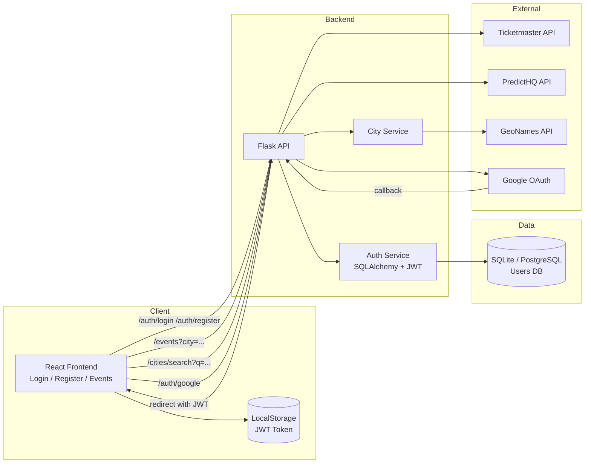

# event-app Architecture Diagram

Below is a high‑level architecture diagram describing how the frontend, backend, and external services interact.

Notes:
- The frontend stores JWTs in `localStorage` (`gt_user_token`).
- The backend aggregates event data from multiple sources.
- City suggestions are fetched from GeoNames when configured; otherwise fallback data is used.
